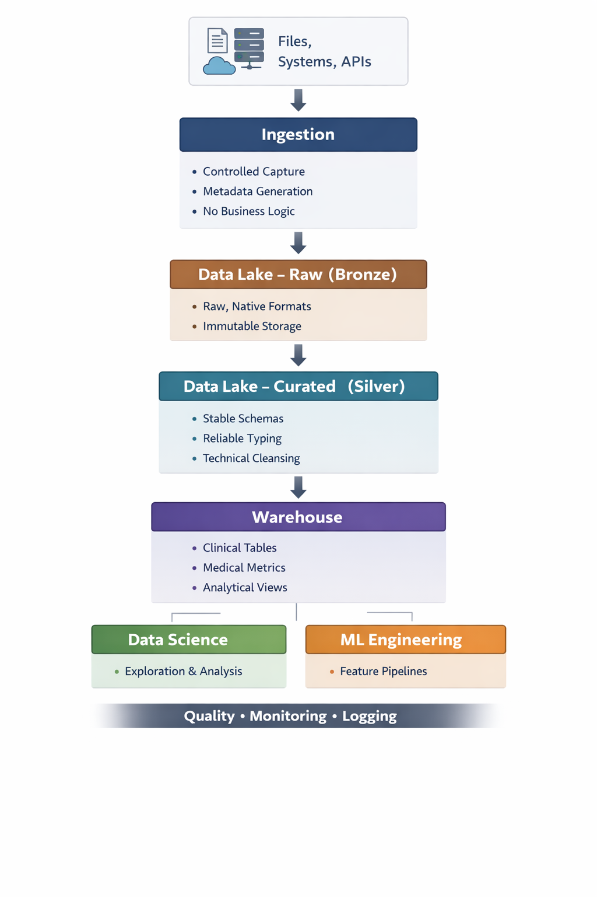

# 🏥 Hippocrates Data Platform

"*The **Hippocrates Data Platform** is a health data foundation designed for demanding clinical environments, providing a robust foundation for analytics, data science, and machine learning. Rather than targeting early uses such as dashboards or opportunistic AI, it imposes an operational discipline focused on data quality, traceability, and governance. Each dataset is governed, observable, auditable, and secure for downstream use, thanks to an architecture that clearly separates ingestion, transformation, validation, storage, and analytical exposure, in line with the sector's regulatory and industrial constraints.*"

---

## 🔃 Design Philosophy

This project is built on a few non-negotiable principles:

* **Data precedes models**
  Machine learning is only as reliable as the data contracts beneath it.

* **Observability is not optional**
  Every pipeline step emits metrics, logs, and execution signals.

* **Healthcare is a domain, not a dataset**
  Transformations are domain-aware, not generic ETL glue.

* **Separation of concerns over tool accumulation**
  Orchestration, storage, validation, and transformation are explicitly decoupled.

---

## Architecture at a Glance

---

## ✅ Core Responsibilities

The platform enforces disciplined ingestion with explicit metadata tracking, feeding a data lake where **Bronze** holds raw clinical records and **Silver** delivers validated, normalized datasets through deterministic transformations. Quality controls ensure schema stability, uniqueness, and outlier filtering before data progresses further.  

From there, a warehouse organizes domain‑oriented analytical tables into clinically meaningful structures, producing feature‑ready datasets for ML. Observability is built‑in, with structured logs, pipeline metrics, and lifecycle events designed for centralized monitoring, ensuring production reliability rather than ad hoc debugging.  

---

## 👥 Intended Audience

* Data Engineers building reliable clinical pipelines
* Data Scientists consuming trusted datasets
* ML Engineers designing production-grade feature pipelines
* Technical leads enforcing data discipline in regulated environments

---

## 🔃 Roadmap

* Extended data contracts and schema versioning
* Feature store alignment
* Incremental ingestion and CDC support
* Automated data quality reporting
* Integration with downstream ML platforms
